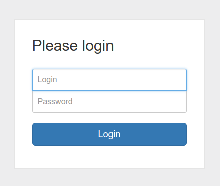
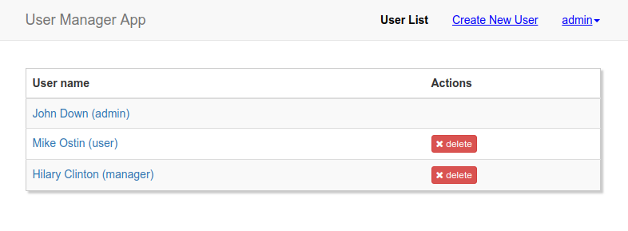

# Web application in Java with JSON-RPC

This project is example create CRUD application for managing users

## Getting Started

### Build frontend

* npm install
* npm run watch (see package.json for all commands)

### Build backend

* Create database from dump file: db.sql
* Config resources database settings files
    * `cp src/main/resources/db.properties.dist src/main/resources/db.properties`
    * `cp src/test/resources/db-test.properties.dist src/test/resources/db-test.properties` (for test database)
* Build war with maven and run at tomcat server

## Built With

* [Jabsorb](https://github.com/gaberger/jabsorb)
* [Tomcat](http://tomcat.apache.org/)
* [Mysql](https://www.mysql.com/)
* [Maven](https://maven.apache.org/)
* [jUnit](https://junit.org/junit4/)
* [Webpack](https://webpack.js.org/)